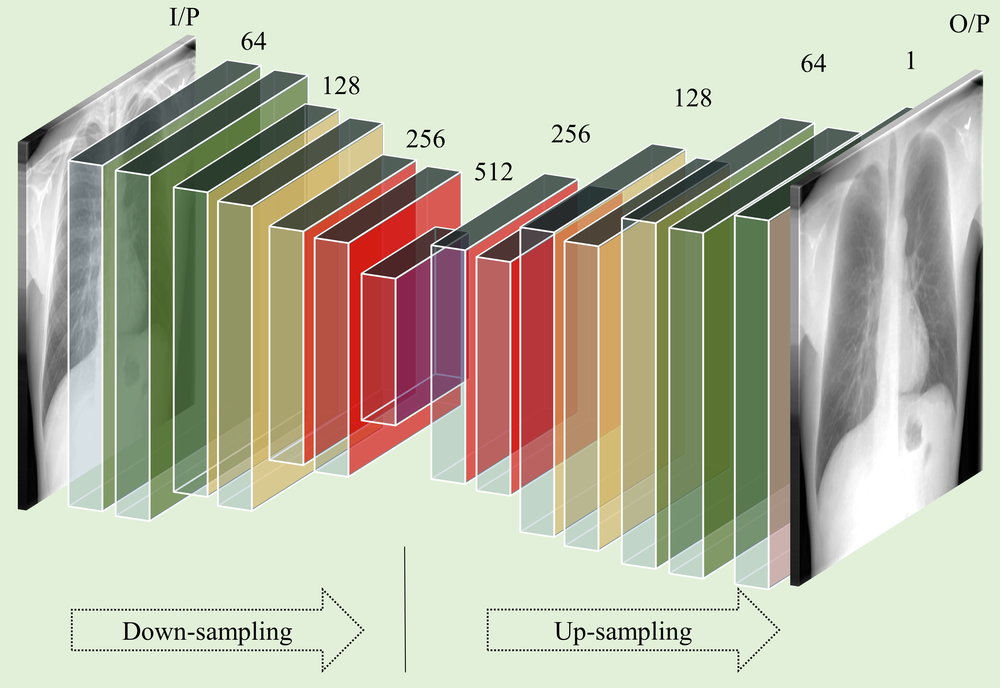
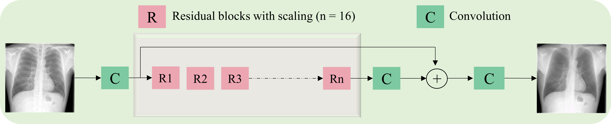
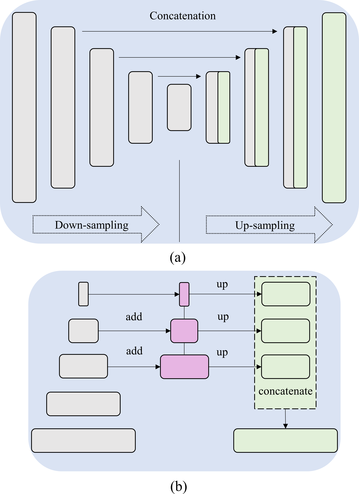
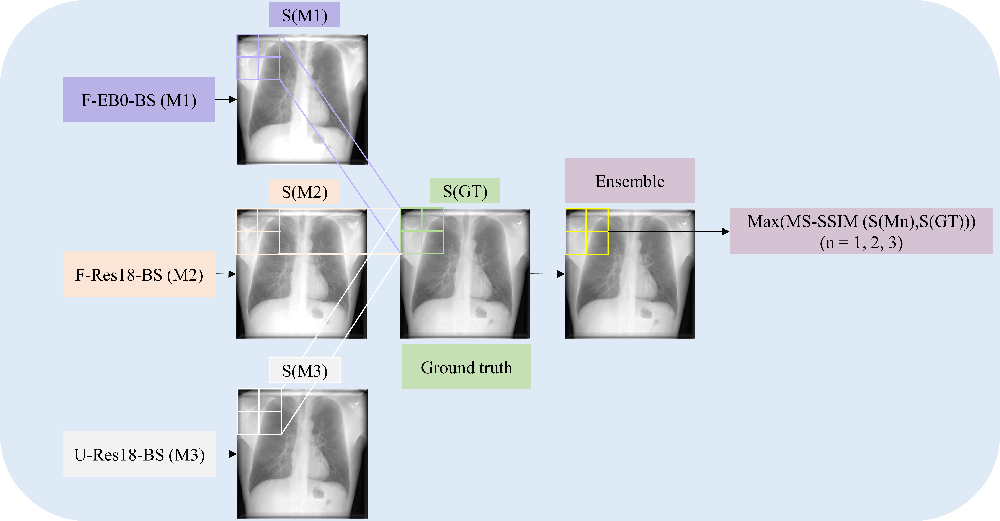
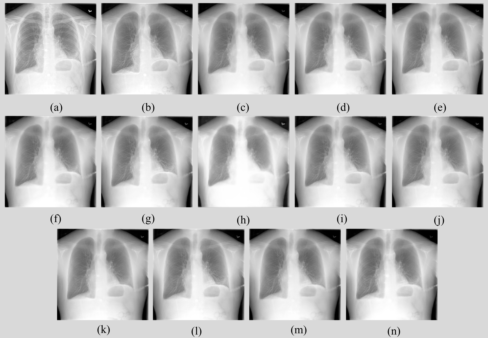
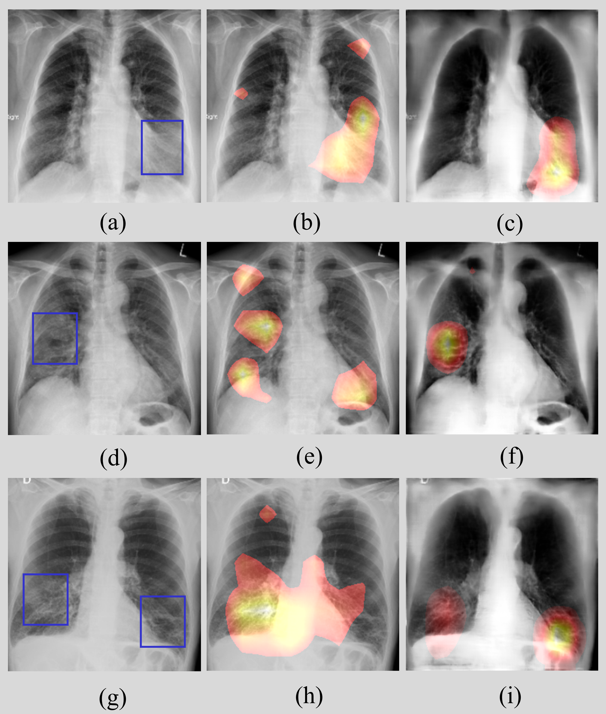

# Bone-Suppresion-Ensemble
Chest X-ray (CXR) is a widely performed radiology examination that helps to detect abnormalities in the tissues and organs in the thoracic cavity. Detecting pulmonary abnormalities like COVID-19 may become difficult due to that they are obscured by the presence of bony structures like the ribs and the clavicles, thereby resulting in screening/diagnostic misinterpretations. Automated bone suppression methods would help suppress these bony structures and increase soft tissue visibility. In this study, we propose to build an ensemble of convolutional neural network models to suppress bones in frontal CXRs, improve classification performance, and reduce interpretation errors related to COVID-19 detection. We train and evaluate variants of U-Nets, feature pyramid networks, and other proposed custom models using a private collection of CXR images and their bone-suppressed counterparts. The ensemble is constructed by (i) measuring the multi-scale structural similarity index (MS-SSIM) score between the sub-blocks of the bone-suppressed image predicted by each of the top-3 performing bone-suppression models and the corresponding sub-blocks of its respective ground truth soft-tissue image, and (ii) performing a majority voting of the MS-SSIM score computed in each sub-block to identify the sub-block with the maximum MS-SSIM score and use it in constructing the final bone-suppressed image. We empirically determine the sub-block size that delivers superior bone suppression performance. It is observed that the bone suppression model ensemble outperformed the individual models in terms of PSNR , MS-SSIM , and other metrics. The best-performing bone-suppression model is used to suppress the bones in publicly available CXR collections. A CXR modality-specific classification model is retrained and evaluated on the non-bone-suppressed and bone-suppressed images to classify them as showing normal lungs or other COVID-19-like manifestations. We observed that the bone-suppressed model training significantly outperformed (p < 0.05) the model trained on non-bone-suppressed images toward detecting COVID-19 manifestations, signifying that bone suppression improved the model sensitivity toward COVID-19 classification. 

# Prerequisites:
Keras >= 2.4.0

Tensorflow-GPU >= 1.9.0

OpenCV >= 3.3

Matlab >= R2021b

The following bone suppression models are proposed in this study. For details regarding the model arcitecture and hyperparameters, plese refer to our ArXiv study available at:

# Autoencoder model with separable convolutions

# Residual block-based model with residual scaling

# U-Net and FPN-based models

# Block diagram of the proposed bone suppression ensemble approach

# Sample bone suppression images predicted by the proposed models

# CRM-based visualization

The repository contains the Python code to reproduce the results proposed in this study. 

